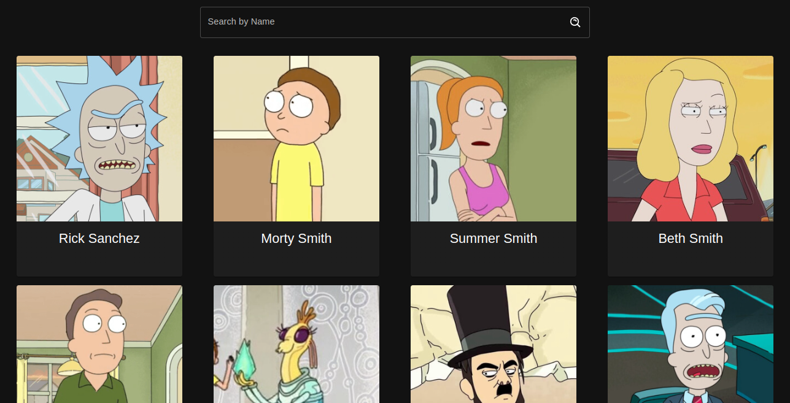
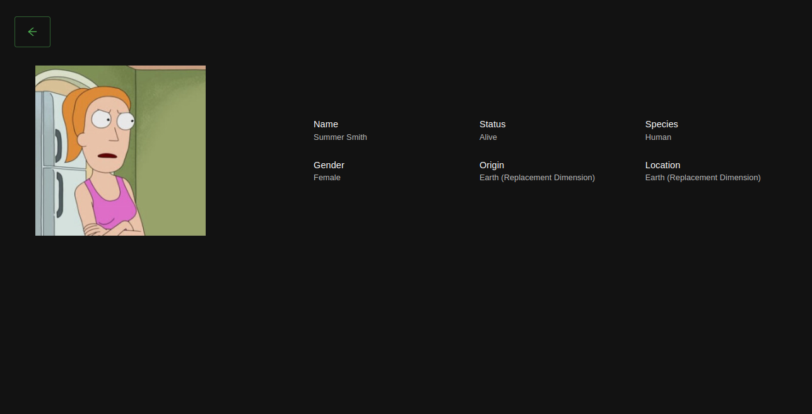
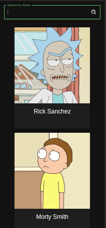
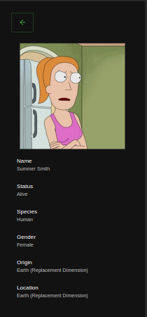

# Rick-and-Morty 

This project was generated using Vite and developed using React and Typescript. Its main functionality is to integrate with the [Rick and Morty](https://rickandmortyapi.com/) Rest API, displaying the content on a responsive webpage.

## How to execute ?

1.Install dependencies

```js
npm i
```
2.Start the serve

```js
npm run dev
```

## Preview

### Desktop



### Mobile

